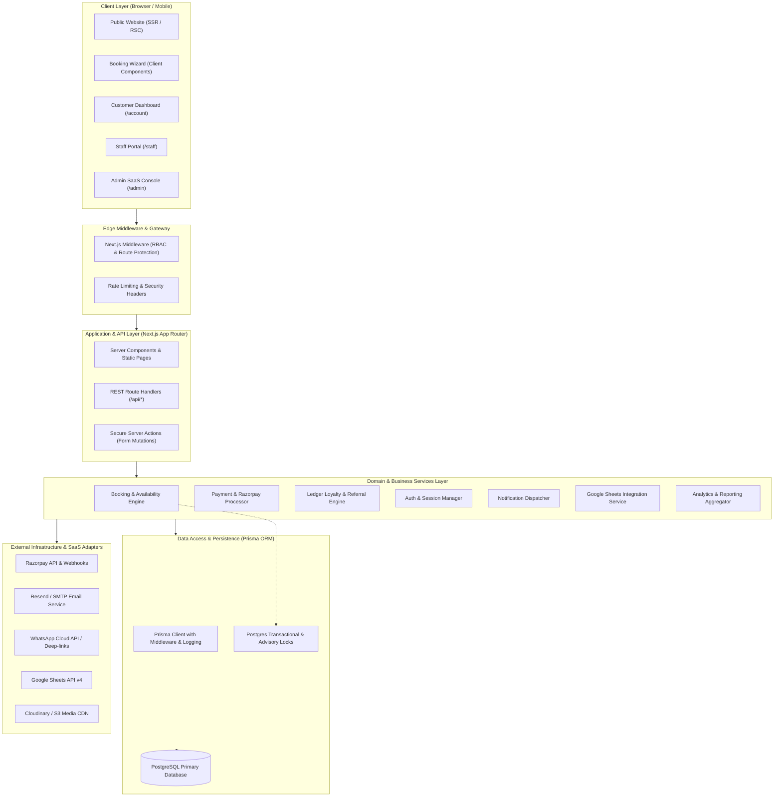
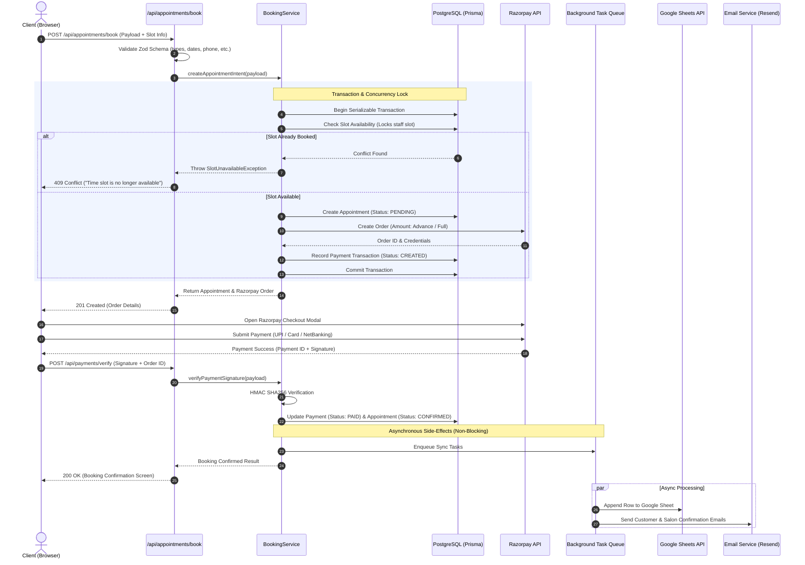

# Beauty Parlor — System Architecture Blueprint

## 1. High-Level System Architecture

The Beauty Parlor platform utilizes a **Modern Clean Architecture** integrated into the Next.js App Router framework. It strictly decouples user interface rendering from business domain rules, transactional persistence, and third-party infrastructure adapters.



---

## 2. Architectural Layers

### 2.1 Presentation Layer (Next.js 15 App Router)
* **React Server Components (RSC)**: Default for all public marketing pages, service descriptions, gallery views, and initial dashboard shell loads. RSCs eliminate client bundle weight, execute directly on the server, and stream HTML with zero hydration overhead.
* **Client Components (`'use client'`)**: Isolated to dynamic leaf nodes:
  - Interactive booking wizard (step states, date pickers, live slot selection).
  - Before/after interactive comparison sliders.
  - Interactive admin data tables with live filtering and modal popups.
  - Responsive navigation menus and dropdowns.

### 2.2 Edge & Routing Middleware (`src/middleware.ts`)
* Intercepts incoming requests prior to route handling.
* Validates session tokens and decodes user role claims.
* Enforces path protection:
  - `/account/*` -> requires authenticated session with role `CUSTOMER`, `STAFF`, `ADMIN`, or `SUPER_ADMIN`.
  - `/staff/*` -> requires role `STAFF`, `ADMIN`, or `SUPER_ADMIN`.
  - `/admin/*` -> requires role `ADMIN` or `SUPER_ADMIN`.
* Adds standard security headers (CSP, HSTS, X-Content-Type-Options, Referrer-Policy).

### 2.3 Application & API Layer (`src/app/api/*`)
* Strictly adheres to RESTful patterns with standard HTTP verbs (`GET`, `POST`, `PATCH`, `DELETE`).
* Enforces Zod input schema validation on all request payloads before hitting services.
* Returns standardized JSON envelope:
  ```typescript
  // Success
  { "success": true, "data": T, "meta"?: { "page": number, "total": number } }
  // Error
  { "success": false, "error": { "code": string, "message": string, "details"?: unknown } }
  ```

### 2.4 Domain & Business Service Layer (`src/services/*`)
* **Zero UI Dependencies**: Business logic is encapsulated in pure TypeScript service classes or modules.
* **Idempotency & Transactions**: Critical state mutations (such as reserving appointment slots, ledger point updates, and order confirmations) execute inside Prisma interactive transactions (`prisma.$transaction()`).
* **Availability Engine**: Algorithmic slot deduction matching requested service duration against business hours, staff shifts, booked intervals, and safety buffers.

### 2.5 Data Access Layer (`src/lib/db/*` & `src/repositories/*`)
* Single Prisma client instance with connection pooling.
* Centralized repositories provide abstracted queries, soft-deletion handling, and query caching where applicable.

### 2.6 External Adapters & Worker Queue Layer (`src/lib/integrations/*`)
* Pluggable interfaces for external vendors:
  - `PaymentGateway`: Implementations for Razorpay (and future Stripe/Cashfree).
  - `NotificationProvider`: Email (Resend/Nodemailer), WhatsApp (Meta Cloud API/Twilio), SMS (Msg91/Twilio).
  - `SpreadsheetSync`: Google Sheets API v4.
* Fail-safe execution: Non-critical operations (emailing, sheets syncing) are wrapped in asynchronous queue workers with exponential retry policies. External service downtime never blocks a customer transaction.

---

## 3. End-to-End Request Lifecycles

### 3.1 Online Booking & Concurrency-Safe Checkout Flow


---

## 4. Scalability & Deployment Topology

* **Stateless Compute**: Next.js runs as a stateless Docker container or Vercel serverless functions, horizontally scalable across multiple regions.
* **Persistent Connection Pooling**: Managed PostgreSQL with PgBouncer connection pooling to efficiently handle concurrent connections without exhausting database socket limits.
* **Asset Storage**: Static luxury imagery and client before/after photos are hosted on an optimized media CDN (Cloudinary / AWS S3) with automatic AVIF/WebP transcoding and caching headers.
* **Graceful Degradation**: If third-party APIs (Google Sheets, SMS, or Email gateways) throttle or throw connection timeouts, the platform logs the incident to the audit database and queues retries without affecting client UI response times.
