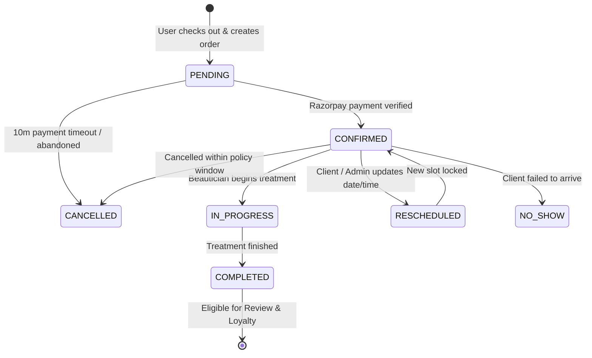

# Beauty Parlor — Real-Time Booking & Availability Engine

## 1. Overview & Core Philosophy

The booking system is the primary revenue-generating engine of the Beauty Parlor platform. Unlike generic booking scripts that display static time blocks, this engine computes dynamic slot availability in real time by intersecting:
1. Salon business hours and public holidays.
2. Individual beautician working shifts and planned recurring breaks.
3. Ad-hoc blocked slots, approved staff leaves, and emergency closures.
4. Active appointments, service execution durations, and sanitization turnaround buffers.
5. Concurrency locks preventing two clients from holding or booking the same slot simultaneously.

---

## 2. The 8-Step Customer Booking Experience

```
[1. Service & Addons] -> [2. Date Picker] -> [3. Time Slot] -> [4. Beautician]
         |
         v
[8. Confirmed Pass]  <- [7. Razorpay Pay] <- [6. Coupon/Loyalty] <- [5. Customer Info]
```

1. **Step 1: Service Selection**: Client selects primary service (e.g., "Hydra Deep Cleansing Facial", 60 mins) and optional addons (e.g., "Under-eye De-puffing Mask", +15 mins). Total duration and price calculate reactively.
2. **Step 2: Date Selection**: Calendar displays next 60 days. Dates marked as closed (e.g., Mondays or Salon Holidays) are disabled with visual tooltip indicators.
3. **Step 3: Beautician Selection**: User can pick a preferred specialist (e.g., "Priya - Bridal Lead") or select **"Any Available Specialist"** (which automatically assigns the beautician with the lowest daily load).
4. **Step 4: Real-Time Time Slot**: Engine computes open intervals for the selected date, beautician, and combined duration. Available slots are rendered in clean time pills (e.g., 10:00 AM, 11:30 AM).
5. **Step 5: Customer Details**: Pre-filled if logged in; guest inputs Name, Phone Number, Email, and special requests/allergies.
6. **Step 6: Coupon & Loyalty Application**: Client can input promo code (e.g., `GLOW15`) or apply accumulated loyalty points for an instant price reduction.
7. **Step 7: Payment Option & Checkout**: Client selects either **Advance Booking Deposit** (e.g., ₹500 to secure the slot) or **Full Payment**. Razorpay checkout modal opens securely.
8. **Step 8: Instant Cryptographic Confirmation**: Once payment signature is verified, booking status transitions to `CONFIRMED`, confirmation screen generates booking number (`BP-XXXX`), and Google Calendar export + WhatsApp confirmation buttons are provided.

---

## 3. Availability Computation Algorithm

When a request arrives at `/api/availability/slots?serviceId=...&date=2026-10-15&staffId=...`:

```typescript
// Algorithmic Flow
function computeAvailableSlots(date, serviceDuration, staffId?): TimeSlot[] {
  // 1. Verify Salon Business Day
  if (isBusinessHoliday(date)) return [];
  const salonHours = getSalonOperatingHours(date); // e.g. 09:00 - 20:00
  if (!salonHours || salonHours.isClosed) return [];

  // 2. Identify Eligible Staff
  const eligibleStaff = staffId 
    ? [getStaffById(staffId)] 
    : getStaffQualifiedForService(serviceId);

  const availableSlotsSet = new Set<string>();

  for (const staff of eligibleStaff) {
    // 3. Retrieve Staff Shift for Day of Week
    const shift = staff.workingHours.find(w => w.dayOfWeek === date.getDay());
    if (!shift || shift.isOffDay) continue;

    // 4. Retrieve Staff Interruptions & Bookings
    const leaves = getStaffLeaves(staff.id, date);
    if (leaves.isFullDayLeave) continue;

    const breaks = staff.recurringBreaks; // e.g. 13:00 - 14:00
    const blockedSlots = getStaffBlockedSlots(staff.id, date);
    const existingAppointments = getActiveAppointments(staff.id, date);

    // 5. Generate Time Increments (e.g., 30-min intervals)
    let cursor = parseTime(shift.startTime);
    const shiftEnd = parseTime(shift.endTime);
    const totalRequiredMinutes = serviceDuration + BUFFER_MINUTES; // default 15 min buffer

    while (addMinutes(cursor, totalRequiredMinutes) <= shiftEnd) {
      const slotEnd = addMinutes(cursor, serviceDuration);
      const slotWithBufferEnd = addMinutes(cursor, totalRequiredMinutes);

      // Check collision with Breaks
      const collidesWithBreak = breaks.some(b => overlaps(cursor, slotWithBufferEnd, b.start, b.end));
      // Check collision with Blocked Slots / Partial Leaves
      const collidesWithBlock = blockedSlots.some(b => overlaps(cursor, slotWithBufferEnd, b.start, b.end));
      // Check collision with Existing Active Appointments
      const collidesWithAppointment = existingAppointments.some(a => 
        overlaps(cursor, slotWithBufferEnd, a.startTime, a.endTimeWithBuffer)
      );

      // Check minimum advance notice (e.g. at least 2 hours from current time)
      const isPastNoticeWindow = isBefore(cursor, addHours(new Date(), MIN_NOTICE_HOURS));

      if (!collidesWithBreak && !collidesWithBlock && !collidesWithAppointment && !isPastNoticeWindow) {
        availableSlotsSet.add(formatTimeString(cursor));
      }

      cursor = addMinutes(cursor, SLOT_STEP_MINUTES); // 30 min step
    }
  }

  return Array.from(availableSlotsSet).sort();
}
```

---

## 4. Concurrency & Race Condition Elimination

To guarantee that two users submitting the exact same slot at the exact same second do not result in a double-booking:

1. **Temporary Soft Hold**: When a user reaches Step 7 and initiates a Razorpay Order, a tentative appointment is inserted with status `PENDING` and a 10-minute expiration lock (`expiresAt = now() + 10 mins`).
2. **Database Isolation**: The insertion executes within a Prisma `$transaction` that validates no overlapping `CONFIRMED` or non-expired `PENDING` booking exists for that staff member.
3. **Cleanup Worker**: A scheduled job or query-level filter treats `PENDING` bookings older than 10 minutes without a confirmed payment as automatically expired and releases the slot.

---

## 5. Appointment Lifecycle State Machine



### State Definitions & Audit Logs
Every state transition triggers an entry into `AppointmentStatusHistory`:
* `oldStatus`: Previous status enum.
* `newStatus`: New status enum.
* `changedById`: User ID of actor (Customer, Staff, Admin, or System).
* `reason`: Mandatory text string for cancellations, rescheduling, and no-shows.
* `createdAt`: Immutable timestamp.
