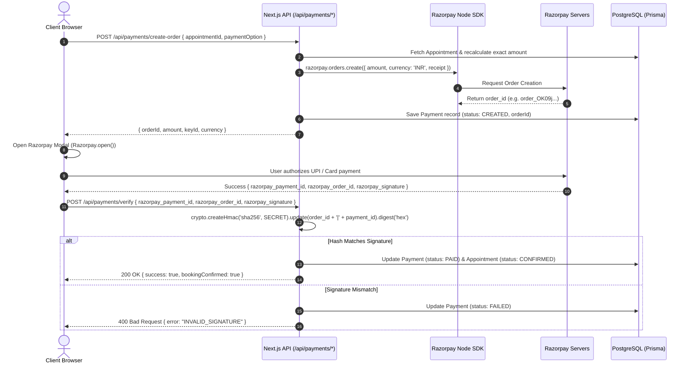

# Beauty Parlor — Payment Architecture & Razorpay Integration

## 1. Overview & Security Principles

Financial operations in the Beauty Parlor platform adhere to strict banking-grade safeguards:
1. **Zero Secret Exposure**: The client application only ever receives the public `RAZORPAY_KEY_ID`. The secret `RAZORPAY_KEY_SECRET` is strictly held on the server runtime.
2. **Server-Side Order Authoring**: Checkout amounts are never accepted from client-side payloads; all prices, deposits, taxes, and coupon discounts are calculated on the backend from verified database entities.
3. **Cryptographic Signature Validation**: All client-returned payment receipts are verified via HMAC-SHA256 hash comparison before updating any database record to `PAID`.
4. **Idempotent Webhook Processing**: Asynchronous Razorpay webhooks reconcile missed client browser drops or network timeouts.

---

## 2. Payment Models

### 2.1 Advance Deposit vs. Full Payment
To protect salon staff against no-shows while maintaining client convenience:
* **Advance Booking Deposit**: Client pays a fixed deposit (e.g., ₹500 or 20% of service value) online via Razorpay. The remaining balance (e.g., ₹1,500) remains marked as `dueAmount` and can be settled at the salon via Cash, UPI QR, or Card POS.
* **Full Pre-Payment**: Client settles 100% of the booking value online, yielding ₹0 balance due at arrival.

```
Total Service Price: ₹2,000
[-] Promo Coupon:     ₹200
[-] Loyalty Points:   ₹100
===========================
Final Payable:       ₹1,700
---------------------------
Advance Paid Online:   ₹500 (Razorpay Transaction)
Remaining Due Salon: ₹1,200 (Settled at Salon Checkout)
```

---

## 3. End-to-End Razorpay Flow



---

## 4. Webhook Reconciliation (`/api/payments/webhook`)

In the event a user completes payment on their mobile banking app but closes their browser before returning to the salon verification screen, Razorpay dispatches an asynchronous server-to-server webhook:

* **Endpoint**: `/api/payments/webhook`
* **Signature Header**: `x-razorpay-signature`
* **Handled Events**:
  - `payment.captured`: Confirms payment and updates appointment status to `CONFIRMED`.
  - `payment.failed`: Flags transaction as failed and notifies customer.
  - `refund.processed`: Updates internal ledger and appointment due balances.
* **Idempotency**: Webhook events are checked against the database; duplicate deliveries of an already processed transaction return `200 OK` immediately without re-triggering notifications.

---

## 5. Refund & Cancellation Policy Rules

* **Cancellation >= 24h prior**: 100% refund of advance deposit (processed through Razorpay refund API, crediting source account within 5-7 business days).
* **Cancellation 4h - 24h prior**: 50% refund or full amount credited as Loyalty Points / Store Credit.
* **Cancellation < 4h prior / No-show**: Advance deposit forfeited to compensate reserved beautician time.
